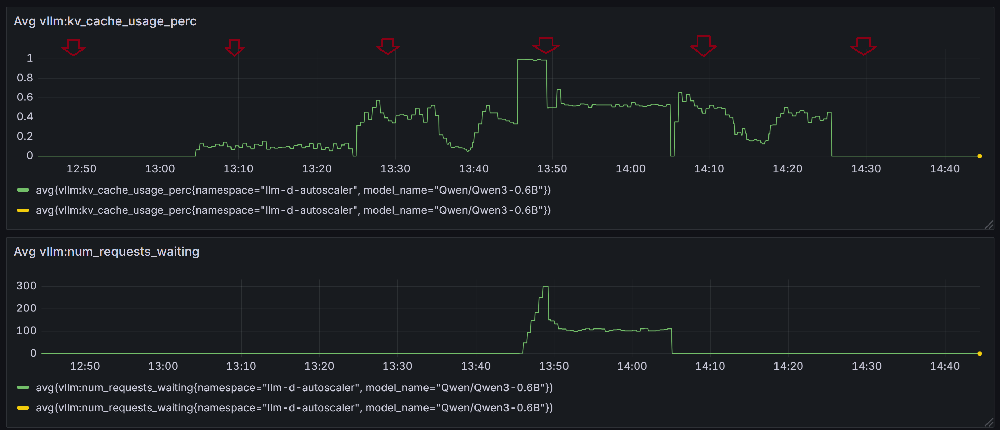
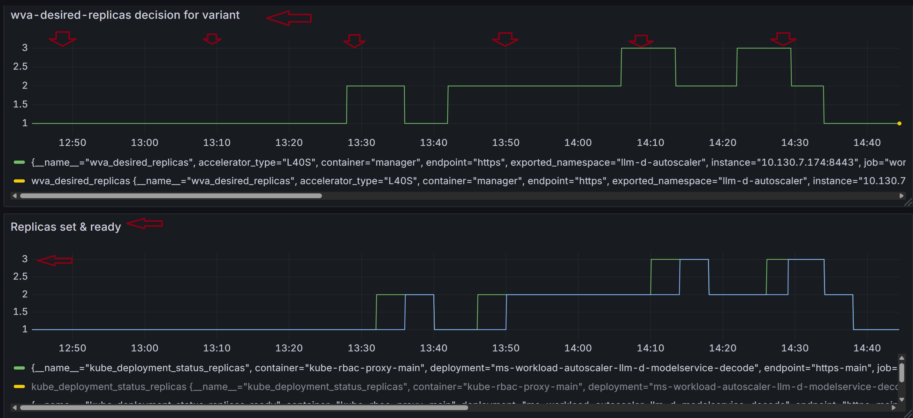
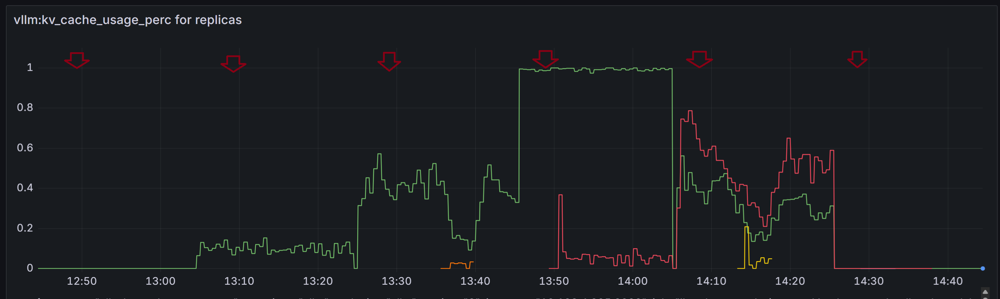
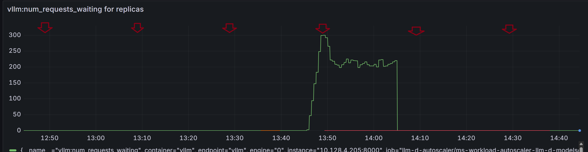
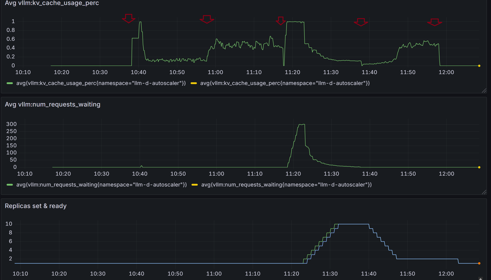
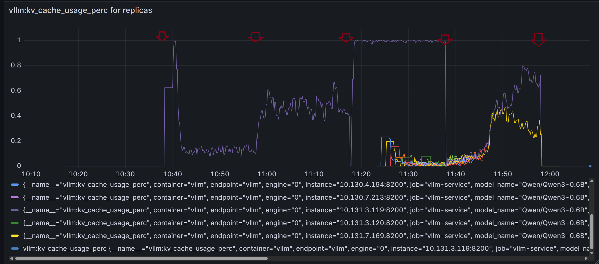
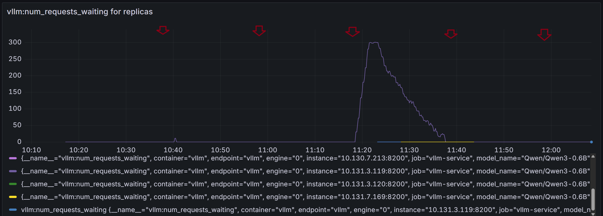

## HPA-based vs WVA Benchmark
### Step 1
Get access to an Openshift cluster with GPUs. This experiment ran on a cluster with H100 GPUs and used up to 10 GPUs.

### Step 2
Follow the steps in https://github.com/llm-d/llm-d-benchmark/blob/main/docs/workload-variant-autoscaler.md to install WVA. For example, the following command installs WVA in `llm-d-test-exp` namespace with `Qwen/Qwen3-0.6B` model.
```
./setup/standup.sh -p llm-d-test-exp -m Qwen/Qwen3-0.6B -c inference-scheduling --wva
```
The following images were recorded for this benchmark run:
- ghcr.io/llm-d/llm-d-inference-scheduler:v0.5.0-rc.1
- ghcr.io/llm-d-incubation/workload-variant-autoscaler:v0.4.2
- docker.io/istio/proxyv2:1.28.1

### Step 3
Review and adjust benchmark parameters if needed. For example, if the benchmark to be ran is `guidellm` `chatbot_synthetic`, then review the file `llm-d-benchmark/workload/profiles/guidellm/chatbot_synthetic.yaml.in`. Here are the parameters used for this benchmark run:
```
target: REPLACE_ENV_LLMDBENCH_HARNESS_STACK_ENDPOINT_URL
model: REPLACE_ENV_LLMDBENCH_DEPLOY_CURRENT_MODEL
request_type: text_completions
profile: constant
rate: [2,3,5,6]         <=== req/s
max_seconds: 1200  <=== for 20 minutes
data:
prompt_tokens_min: 10
prompt_tokens_max: 8192
prompt_tokens: 4096
prompt_tokens_stdev: 2048
output_tokens_min: 10
output_tokens_max: 2048
output_tokens: 1024
output_tokens_stdev: 512
samples: 1000
seed: 1234  <=== seed
```

### Step 4
Review and edit WVA configmap `capacity-scaling-config` as needed. Here are the parameters used for this benchmark run:
  ```
  kvCacheThreshold: 0.8    <=== vllm:kv_cache_usage_perc
  queueLengthThreshold: 5  <=== vllm:num_requests_waiting
  kvSpareTrigger: 0.3   <=== updated from 0.1
  queueSpareTrigger: 3
  ```
### Step 5
Run the benchmark by following https://github.com/llm-d/llm-d-benchmark/blob/main/docs/workload-variant-autoscaler.md.  This experiment ran with `guidellm` and `chatbot_synthetic`, and `Qwen/Qwen3-0.6B` for example:
```
./run.sh -l guidellm -w chatbot_synthetic -p llm-d-test-exp -m Qwen/Qwen3-0.6B -c inference-scheduling
```

### Step 6
Configure Grafana to see the results. The result for this benchmark run for WVA:
    
    
    
    
  - Notes on result:
    - WVA only needed to scale up to 3 replicas in this experiment.
    - ~ 13:42 - 14:05, WVA only needed to scale to 2 replicas although the average KV cache usage and average number of requests waiting are high because WVA considered one of the replica (green) was saturated and didn't include its load in average calculation.

### Step 7
- Delete HPA created in the namespace (`llm-d-test-exp`)
- Create HPA to scaled based on `vLLM` metric instead of WVA. The following HPA were used in this benchmark run targeting the deployment `qwen-qwe-07df2612-en3-0-6b-decode`:
  ```
  apiVersion: autoscaling/v2
    kind: HorizontalPodAutoscaler
    metadata:
        annotations:
            meta.helm.sh/release-name: workload-variant-autoscaler
            meta.helm.sh/release-namespace: llm-d-autoscaler
        name: vllm-deployment-hpa-manual
        namespace: llmdbench
    spec:
        behavior: <=== this section is same as for WVA
            scaleDown:
                policies:
                - periodSeconds: 60
                    type: Percent
                    value: 10
                selectPolicy: Max
                stabilizationWindowSeconds: 240 <=== to avoid fluctuation
            scaleUp:
                policies:
                - periodSeconds: 60
                    type: Pods
                    value: 1   <===  1 pod at a time within 60 seconds
                selectPolicy: Max
                stabilizationWindowSeconds: 240
        maxReplicas: 10  <=== maxReplicas
        metrics:
        - external:
            metric:
                name: vllm:num_requests_waiting  <===
                selector:
                matchLabels:
                    namespace: llm-d-autoscaler
            target:
                averageValue: "3" <=== same as queueSpareTrigger
                type: AverageValue
            type: External
        - external:
            metric:
                name: vllm:kv_cache_usage_perc  <===
                selector:
                matchLabels:
                    namespace: llm-d-autoscaler
            target:
                averageValue: "600m"  <=== threshold 0.8 - spare 0.3 + .1 ()
                type: AverageValue
            type: External

        minReplicas: 1
        scaleTargetRef:
            apiVersion: apps/v1
            kind: Deployment
            name: qwen-qwe-07df2612-en3-0-6b-decode
  ```

### Step 8
Repeat step 5 above to run the benchmark. The result for this benchmark run for HPA:
    
    
    
- Notes on result:
  - ~ 10:40, there's a spike in vllm:kv_cache_usage_perc but HPA didn't scale up for that temporary spike. Similarly are other spikes in 11:00 - 11:20.
  - ~ 11:23, HPA started to scale up 1 pod per minute as its configuration. Requests were also sent to scaled-up replicas.
  - ~ 11:38, HPA started to scale down as average KV cache usage and number of requests waiting decreased.
  - ~ 11:25, there were around 5 replicas; however, HPA continued to scale up since the average KV cache usage and number of requests waiting (among all replicas) were still high - mostly due to the 1 replica (in purple); where as with WVA, that 1 replica would be considered saturated and not be included in average calculation. Hence in this case WVA might not need to scale up.
